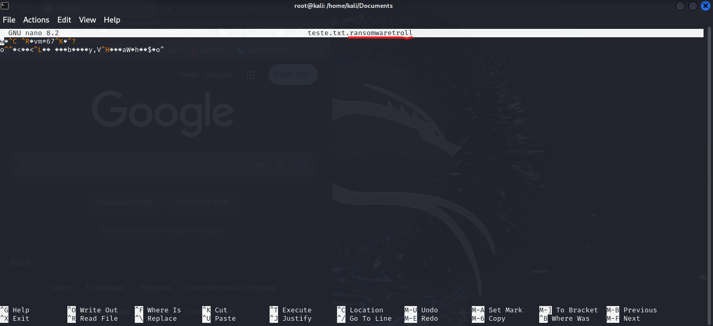

### Para encriptografar o arquivo teste.txt 
Precisamos executar o encriptador no terminal Linux:  
python encrypter.py

Com isso já é possível abrir o arquivo e ver que ele se encontra criptografado e com o nome trocado.  

 

### Para descriptografar  

Precisamos executar o decriptador no terminal:  
python decrypter.py  

Após isso podemos ver que já está legível nosso arquivo txt.  

